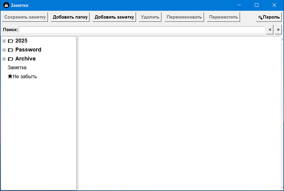

# Notes

Минималистичное приложение с графическим интерфейсом для ведения заметок.

✅Функциональность:
- Создание папок
- Создание заметок
- Возможность редактирования, перемещения и удаления как папок так и заметок.
- Возможность защитить данные с помощью пароля (шифрование AES 256)

Заметки хранятся в файле Notes в той же папке что и само приложение app.exe

Программа не оставляет никаких лишних следов. Ничего никуда не пересылает и не требует доступа в интернет.

Сделано для личного использования ;)

 
        
[СКАЧАТЬ/x64](https://github.com/ajdishnik/Notes/raw/refs/heads/main/app.exe)
