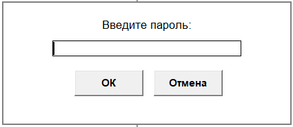

# Notes
Код представляет собой довольно продвинутый и функциональный GUI-приложение на Python с использованием tkinter, которое реализует зашифрованный менеджер заметок с древовидной структурой. Вот подробный анализ по разным аспектам:

✅  Функциональность:
- Создание папок
- Создание заметок
- Возможность редактирования и удаления
- Возможность защитить данные с помощью пароля (мощное шифрование AES 256)

Заметки хранятся в файле Notes в той же папке что и само приложение app.exe
Программа не оставляется никаких лишних следов. Ничего никуда не пересылает и не требует доступ в интернет.
Для переноса заметок на другое устройство/приложение придётся удалить пароль чтобы расшифровать файл заметок - только после этого можно будет спокойно с ним работать в других приложениях. 

 
 
        
[СКАЧАТЬ/DOWNLOAD] (https://github.com/ajdishnik/Notes/raw/refs/heads/main/app.exe)
